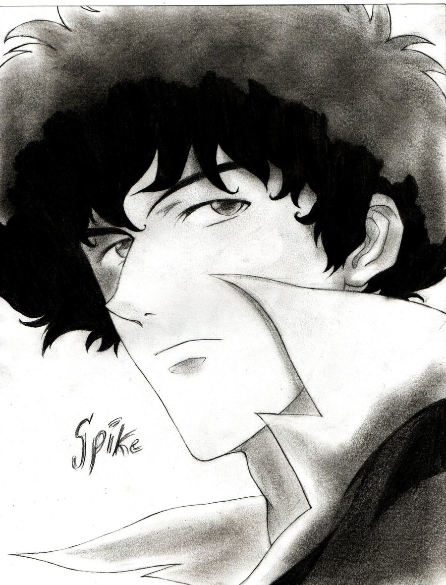

# Visa photo maker
A simple python program to prepare visa photo tile.

## Introduction
- The program defines an object of class `visa_photo()` has features of width and height (in inches)
- `dim()` method prints the dimension of the object
- `print_photo(img, filename, dip, actual_w, actual_h)` method prints the imported `img` to the `visa_photo` object as a photo tile and save it with user given `filename` and `dpi` value; `actual_w` and `actual_h` are the physical (printed) width and height (in inches) of a single photo in the photo tile. For example, US visa photo has the dimension 2 X 2.
- Dependent modules: `Image`, `matplotlib`.

## Example:

```python
>>> from image_process import *
# initial an empty object with dimension 6 by 4
>>> p = visa_photo(6, 4)
# read the photo need to be printed
>>> img = Image.open('./photo/IMG_1135.JPG')
# print the photo on the canvas with 500 dpi
>>> p.print_photo(img, 'usvisaphoto', 500, 2, 2)
```
- Original photo

    

- Photo tile (US visa standard) made from the program
    

